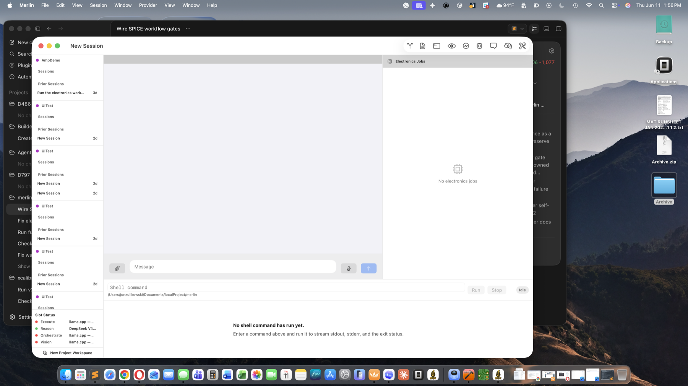
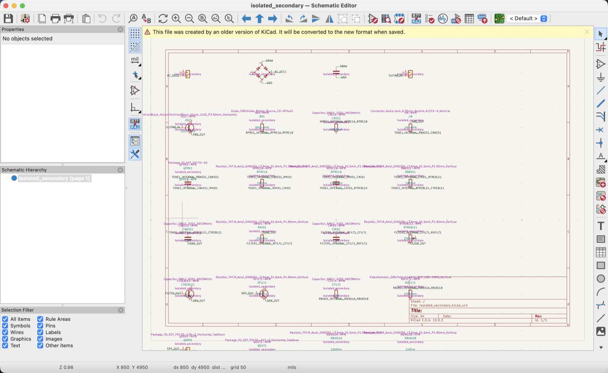
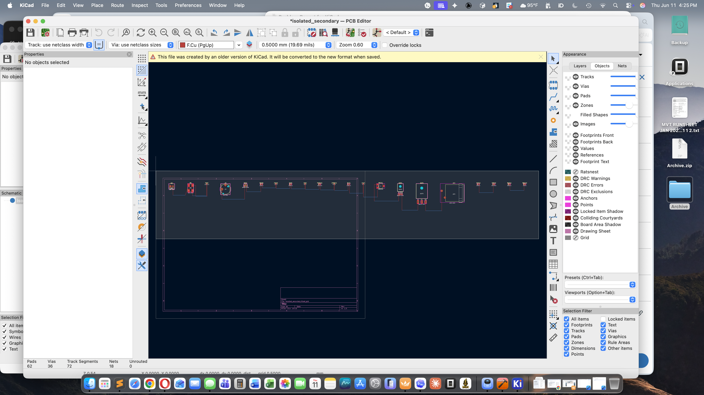
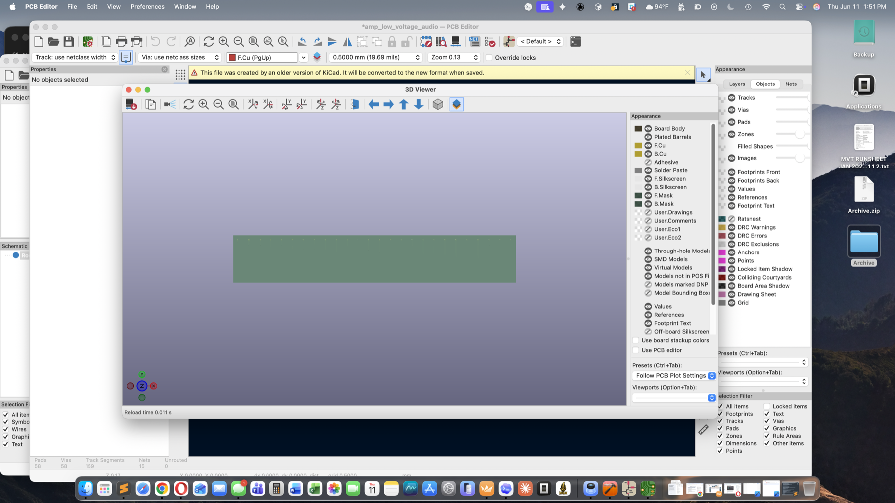
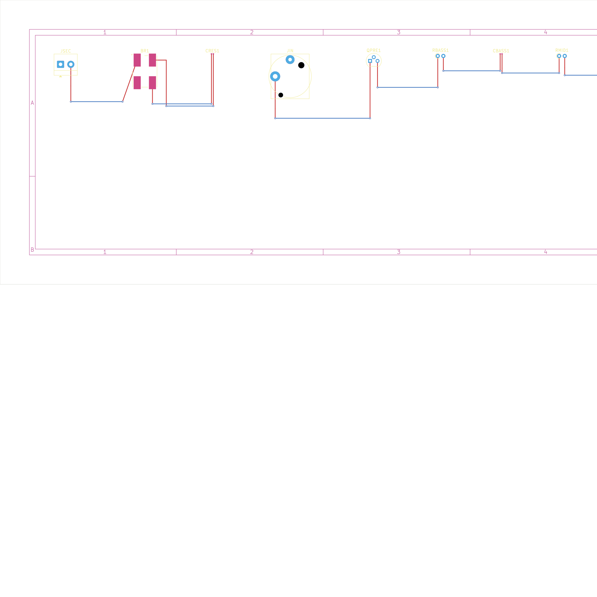

# Merlin v2.4.0

## Summary

v2.4.0 turns release readiness into an evidence-backed gate. The release is not
considered publishable from version metadata alone: the full GUI, provider,
capability, electronics/KiCad, screenshot, safety, tag, push, and GitHub Release
sequence must pass with durable artifacts.

## What's new

- **Full green E2E release battery.** The release path now requires full
  `MerlinTests`, full `MerlinUITests`, focused visual tests, live DeepSeek
  provider coverage, local-provider pair smokes, llama.cpp router checks,
  xcalibre RAG verification, S1/S2 capability convergence, and service cleanup.
- **Deterministic release runner.** `scripts/release/run-capability-gate.sh`
  owns its temporary config, provider registry, llama.cpp router, xcalibre
  server, watchdog, logs, and cleanup for S1/S2 release convergence.
- **Electronics/KiCad evidence gates.** The electronics release path now
  validates deterministic KiCad output, routed boards, DRC evidence,
  schematic/PCB screenshots, routed layer exports, and 3D board evidence.
- **Release screenshot placement.** Public README screenshots live under
  `docs/assets/screenshots/v2.4.0/`; evidence-only captures remain with the E2E
  report under `docs/e2e/2026-06-08-v2.4.0-release/`.

## Internal changes

- Added a fixed release ledger at
  `docs/e2e/2026-06-08-v2.4.0-release/RELEASE-RUN.md`.
- Added the release evidence report at
  `docs/e2e/2026-06-08-v2.4.0-release/REPORT.md`.
- Hardened release capability convergence around llama.cpp model preflight,
  TaskBoard repair-loop continuation, source-edit stop detection, runner
  watchdog cleanup, and deterministic S1/S2 completion evidence.
- Hardened electronics/KiCad release checks around evidence-scoped workflow
  gates, generated schematic/PCB usability, routed board evidence, bundled KiCad
  symbol geometry for CI, and public screenshot assets.
- Published the GitHub Release with evidence report, release ledger, Merlin UI
  screenshots, and KiCad screenshots attached as release assets.

## Migration

No user data migration is required. Existing provider settings still load. For
release validation, use the documented release runner and evidence ledger rather
than ad hoc screenshots or manual status claims. The electronics domain remains
an evidence-gated workflow infrastructure release, not a blanket
fabrication-ready signoff for every generated board.
